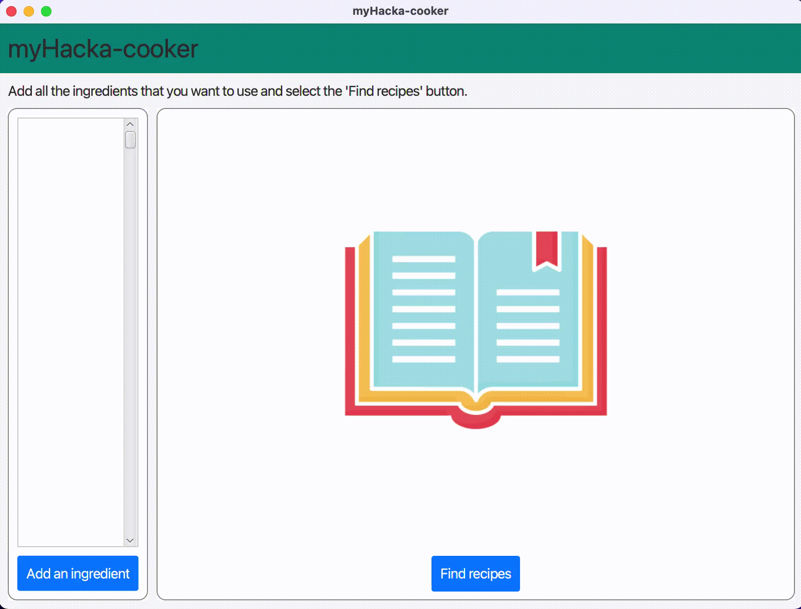

# Hackaton, University of Southampton - Feb 2020
A Smart Recipe Book application. You simply log the items that you would like to cook with and it shows you a list of recipes for them. There is a demo.mov file which shows the app's basic functionality. Note that my team and I developed the application in under 8 hours at a Hackaton event in Southampton. We had just started learning JavaFX as part of the university's curriculum so this project was mostly done for educational purposes. We didn't win a prize at the Hackaton, but we had a lot of fun and we definitely learned a great deal about JavaFX! (Notice the little pixel-art food icons that we created, aren't they absolutely amazing)  

#Other Team Members:
1) Philip Stambolov ps1g19@soton.ac.uk
2) Raya Bakarska rb1u19@soton.ac.uk
3) Velina Ivanova vv1u19@soton.ac.uk

# The End Product

